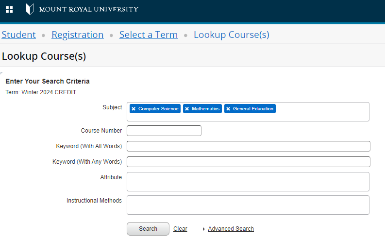
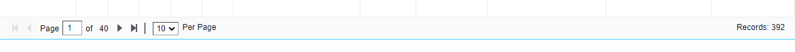
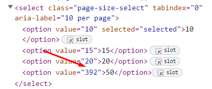

# MACOCAST Tools (MACO Calendar & Scheduling Tool)

## Overview

In order for MACOCAST to work, it's gotta have information about the scheduling for a given semester: who's teaching what, where, and when. Since I don't have direct access to the databases with this juicy info, I have to come at it sideways: scraping info from https://ban9ssb-prod.mtroyal.ca/StudentRegistrationSsb/ssb/term/termSelection?mode=search

The general process is as follows (more detailed steps follow below):

1. Scrape the page for a given semester.
2. Turn that scrape into a CSV.
3. Refine that CSV to exclude some entries, re-include some of those exclusions, and modify others.
4. Use that refined CSV to add rows to some database tables I control.

The database tables are then used to populate MACOCAST.

## Detailed Steps

### Scrape the page for a given semester

0. Make a new directory in `semesters` in this repo. Give it a `yyyy-ss` name. For example, 2024-04 is fall 2024. While you're in here, create a file called `yyyy-ss.html` in that directory.
1. Pop open a browser and go to https://ban9ssb-prod.mtroyal.ca/StudentRegistrationSsb/ssb/term/termSelection?mode=search
2. Select the term (the web page says term; I think it should be semester, but whatever) you want to scrape.
3. Enter the desired search criteria. We want Computer Science, Mathematics, and General Education.

4. Inspect the "per page" part of the page in your browser inspector, because we need to do a hack that allows us to see ALL of the records instead of just a few. Take note of the number of records, too, because you'll need that in the next step.

5. Change the markup of the dropdown so that the value is equal to the number of records you noted in the previous step.

6. Select the hacked dropdown option in the browser. Wait for a while, because it's going to take some time. 
7. In the inspector, right-click in the Elements tab, choose Edit as HTML, and copy that monster beast into the `yyyy-ss.html` file you made in step 0.
